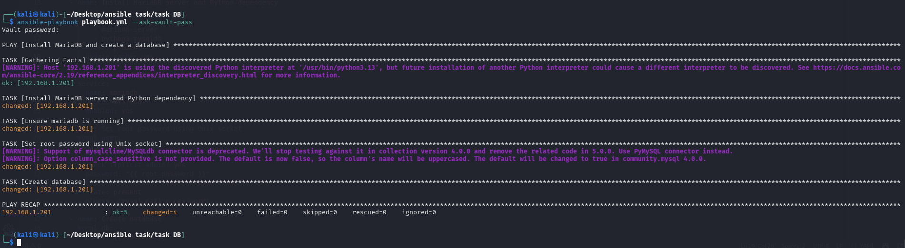
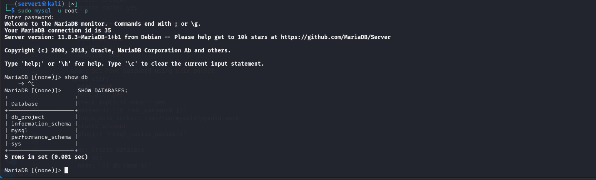
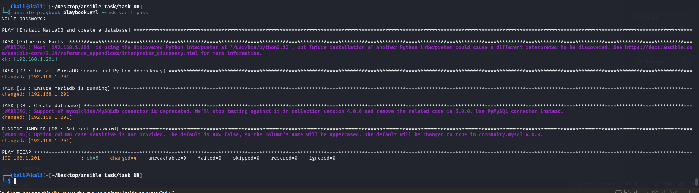
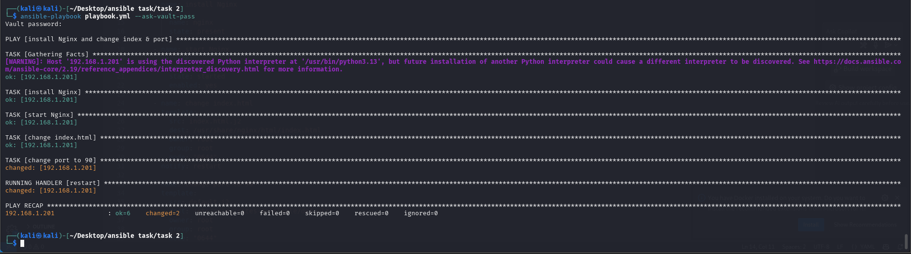
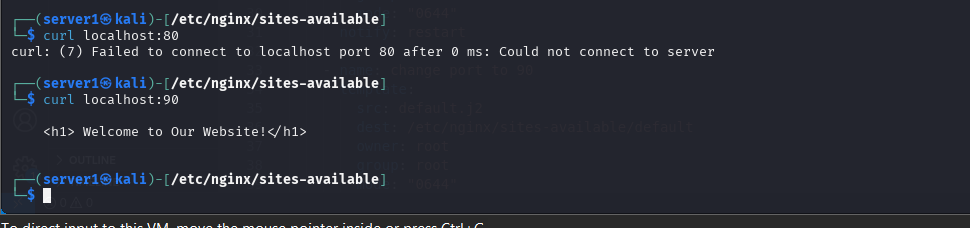
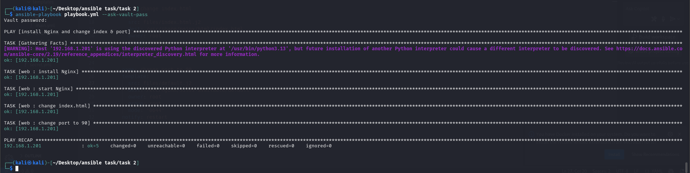

# Ansible_Final_Task

## Task 1

### First image: After successful run without applying Ansible role

### Second image: Verifying database access

### Third image: After applying Ansible role

## Task 2

### First image: After successful run without applying Ansible role

### Second image: Verification of port change and index page

### Third image: After applying Ansible role

